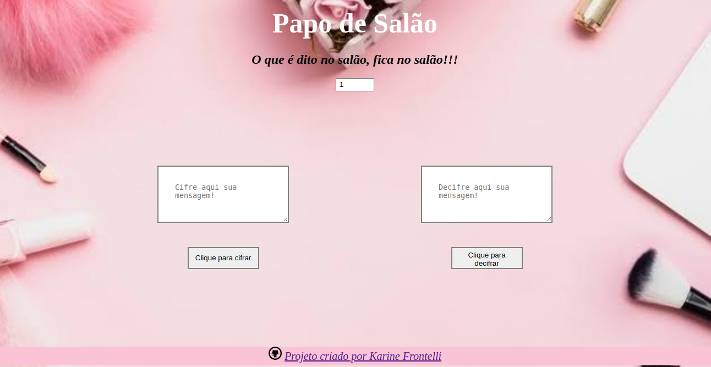

  # Cifra de César - Papo de Salão #

  ## Índice

  *  1.Projeto
  *  2.Protótipo
  *  3.Resumo do projeto
  *  4.Usuário
  *  5.Necessidades dos usuários
  *  6.Instruções de uso

  ***

  ## 1. Projeto

  Projeto desenvolvido para codificar e decodificar mensagens, usando a Cifra de César como método. 

  ## 2. Protótipo

  O processo de desenvolvimento do layout foi rápido, pensado em ser um projeto clean e direto ao ponto, como vemos na imagem. No final dessa apresentação, veremos a imagem finalizada com pequenas alterações.

  

  ## 3. Resumo do projeto

  Desenvolvido para troca de mensagens entre amigas. Tema escolhido com base na minha experiência em salões de beleza.

  ## 4. Usuário

  Clientes assíduas de salão de beleza!

  O projeto foi desenvolvido pensando em clientes de salão, mulheres que se encontram na cadeira e colocam o papo em dia. Como todas sabemos, nem tudo pode ser dito abertamente, porque não só as paredes tem ouvidos! 
  

  ## 5. Necessidades do usuario

  Pensando nisso, esse projeto foi desenvolvido. Sabe quando você tem aquele assunto mais íntimo para contar para a amiga. Utilize o PAPO DE SALÃO. Assim as mensagens serão codificadas e somente ela poderá ter acesso com a chave que correta, não correndo o risco de qualquer pessoa ter acesso à mensagem.

  ## 6. Instruções de uso

  O Layout já é bem intuitivo, na caixa com o numero inicial "1" é onde deve ser escolhida a chave de deslocamento, na caixa maior temos a frase "Cifre aqui sua mensagem!" onde deve ser inserida a mensagem desejada e logo abaixo o botão de "Clique para cifrar", o mesmo ocorre na caixa "Decifre aqui sua mensagem!", insira a mensagem codificada e informe a chave, clicando no botão "clique para decifrar" terá sua mensagem pronta para a leitura.

  

